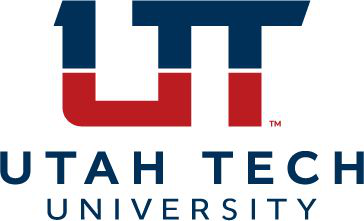

 

# National Student Clearinghouse Transfer
<!-- badges: start -->

<!-- badges: end -->
Welcome to the National Student Clearinghouse repository.  The National Student Clearinghouse (NSC) repository contains a codebase for creating detailed data tables using RStudio. These tables serve as a centralized platform for visualizing and analyzing transfer data. The repository supports the creation of reports that analyze transfer pathways and outcomes for students moving between institutions, tracking key metrics like transfer and completion rates.

## Table of Contents
- Introduction
- Preparing the file for upload to NSC
- Uploading the file to NSC
- Return file preparation to upload to Edify
- Uploading the file to Edify

## Introduction 
Using data from the National Student Clearinghouse, we can analyze student transfer patterns and outcomes. This data helps track key metrics such as transfer rates, completion rates, and other important indicators. By examining these metrics, we gain insights into the pathways students take when transferring between institutions, which can inform policies and practices to support student success. 

- This repo contains sql and r code to generate and submit data to the National Student Clearinghouse (NSC) and generate the upload to Edify from the returned file. 

- You must have FTP permissions to the NSC site. (The Registrar can grant permissions.) 

- You must have access and be connected to /Share/Research/National Student Clearing House. (Command K)

## Preparing the file for upload to NSC
Sign into Edify -> Export tab -> search for nsc_upload -> select table -> Execute DB Refresh to have the latest data from Slate and Banner.  

Open nsc_upload.rmd and run all the code chunks.  It will produce four files: enrolled, applicant, prospect, and inquiry. (We break them apart because of the upload file restrictions on NSC site.) I create a folder with the month and year on the shared drive in the National Student Clearing House folder to hold the files.  

## Uploading the file to NSC
Sign into NSC https://www.studentclearinghouse.org/ using the FTP login.  Upload the four files, an email is sent to Andrea Bringhurst at UT with a subject of Delivery Receipt for (name of file) one for each file uploaded. A second email is sent to UT with a subject of StudentTracker File Accepted for Organization ID 003671-00 to let you know if your file was accepted or rejected with the errors/warnings. A third email is sent to UT with a subject of New Files Notification to let you know that you can download the files.  There are three files for each uploaded file.  The AGGRRPT file is a STUDENTTRACKER AGGREGATE REPORT: ANALYSIS OF INITIAL TRANSFERS, we are not currently using this file in Edify. The CNTLRPT file is an htm file with information similar to the AGGRRPT file, we are not currently using this file in Edify.  We use the DETLRPT file to produce the upload for Edify. Download this file to the shared drive in the National Student Clearing House folder.  I shorten the file name and save them to the folder on the shared drive.

Files will be uploaded the first week of November and the third week of March.

## Return file preparation to upload to Edify
Open edify_upload.rmd -> verify the file name and folder under ## Load Return Files and ## Generate NSC Upload to Edify File (You will need to update if you created a new folder for the downloaded files.).  Run all code chunks, this will produce one file to be loaded into Edify.

## Uploading the file to Edify
Sign into Edify -> Intake tab -> flat_files -> outcome_measures_nsc_output -> Upload File 
After uploading you can check the status of the upload on the Intake Status tab second down on the left hand side; if there are errors look at the View Details on the far right side.  Once the status has completed without errors -> Build tab -> filter for nsc_outcomes -> select file name -> Execute Build Plan.  You can check the Build Plan Status from the second tab on the left side, if there are errors click on View Details.

## Contact
For questions or feedback, please contact us at datablaze@utahtech.edu.

Thank you for using the National Student Clearinghouse Transfer Report!  We hope the reports help you make data-driven decisions to improve the university's operations and outcomes.
